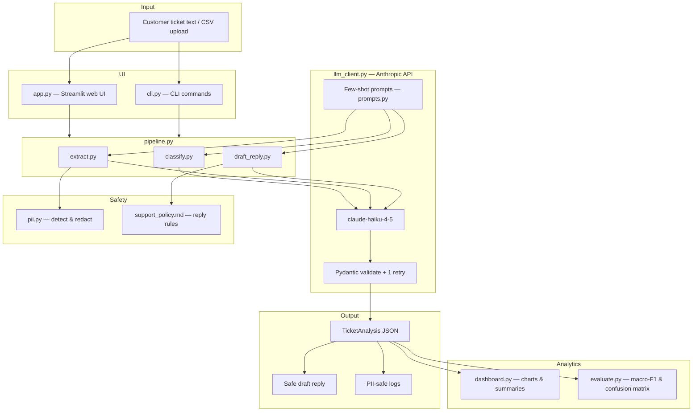

# SupportOps Copilot

A customer support AI system that turns messy tickets into structured analysis, policy-safe draft replies, dashboards, and evaluation metrics.

**Live repo:** [github.com/sariatasleem160/SupportOps-Copilot](https://github.com/sariatasleem160/SupportOps-Copilot)

**Workflow:** messy ticket → classify → extract → validate (Pydantic) → PII-safe logging → draft reply → dashboard → metrics

---

## Architecture



See [docs/ARCHITECTURE.md](docs/ARCHITECTURE.md) for module-level detail.

---

## Features

| Module | Purpose |
|--------|---------|
| `classify.py` | Category, priority, sentiment, SLA risk (few-shot + JSON) |
| `extract.py` | Product, request summary, missing info, refund flag, PII types |
| `draft_reply.py` | Policy-grounded reply using `data/support_policy.md` |
| `pii.py` | Detect and redact email, phone, address, card, SSN before logging |
| `dashboard.py` | Ticket pattern summaries and charts |
| `evaluate.py` | Macro-F1, priority accuracy, key-field accuracy on labeled CSV |
| `app.py` | Streamlit UI (single ticket, batch upload, dashboard, escalation flags) |
| `cli.py` | Command-line analyze, batch, evaluate, metrics |
| `llm_client.py` | Anthropic client, JSON parsing, retry-on-error, cost tracking |
| `pipeline.py` | End-to-end orchestration |

---

## Quick start (Windows — easiest)

1. Clone the repo and open the folder
2. Copy `.env.example` → `config.env`
3. Paste your **Anthropic API key** in `config.env`
4. Double-click **`START.bat`**
5. Open browser: **http://127.0.0.1:8501**

---

## Quick start (manual)

```bash
python -m venv .venv
.venv\Scripts\activate          # Windows
pip install -r requirements.txt

# Create config.env from template and add your key
copy .env.example config.env

# Analyze one ticket
python cli.py analyze -m "I was charged twice for Pro plan."

# Run evaluation on 35 labeled test tickets
python evaluate.py

# Launch web app
streamlit run app.py
```

---

## Data

| File | Description |
|------|-------------|
| `data/tickets_train.csv` | 35 labeled tickets for reference / prompt design |
| `data/tickets_test_labeled.csv` | 35 held-out labeled tickets for evaluation |
| `data/support_policy.md` | Refund, access, shipping, PII, and escalation rules |

Required CSV columns: `ticket_id`, `customer_message`, `true_category`, `true_priority`, `true_product`, `true_refund_request`

**Example categories:** billing, technical_bug, account_access, refund, shipping, feature_request, other

**Example priorities:** low, medium, high, urgent

---

## Output schema

Each processed ticket produces JSON matching `TicketAnalysis` in `schemas.py`:

```json
{
  "category": "billing",
  "priority": "high",
  "sentiment": "negative",
  "sla_risk": true,
  "product": "Pro plan",
  "customer_request": "Refund duplicate charge",
  "missing_information": ["order ID"],
  "refund_request": true,
  "pii_detected": ["email"],
  "safe_reply": "...",
  "confidence": 0.9
}
```

Validation uses Pydantic; on failure the pipeline **retries once** with the validation error appended to the prompt.

---

## Evaluation targets

| Metric | Target |
|--------|--------|
| Category macro-F1 | ≥ 0.75 |
| Priority accuracy | ≥ 0.75 |
| Key-field accuracy (product + refund) | ≥ 0.80 |
| PII redaction tests | 100% pass (`pytest tests/test_pii.py`) |

Run `python evaluate.py` to write:

- `results/eval_summary.json`
- `results/confusion_matrix.png`
- `results/latency_cost_summary.json`
- `results/sample_outputs.jsonl`

### Cost and latency

Using **claude-haiku-4-5** (default), expect roughly:

- **Median latency:** ~3–8 s per ticket (3 LLM calls: classify, extract, draft)
- **Cost per ticket:** ~$0.002–0.008 USD (depends on message length)

Exact numbers are written to `results/latency_cost_summary.json` after each run.

---

## Tests

```bash
pytest tests/ -v
```

No API key required for unit tests.

---

## Project structure

```
├── data/
│   ├── tickets_train.csv
│   ├── tickets_test_labeled.csv
│   └── support_policy.md
├── docs/
│   └── ARCHITECTURE.md
├── results/
├── tests/
├── app.py
├── cli.py
├── classify.py
├── dashboard.py
├── draft_reply.py
├── evaluate.py
├── extract.py
├── llm_client.py
├── pipeline.py
├── pii.py
├── prompts.py
├── schemas.py
├── START.bat
├── run_web.ps1
├── .env.example
├── pytest.ini
├── requirements.txt
└── README.md
```

---

## Stretch goals included

- Confusion matrix image (`results/confusion_matrix.png`)
- Per-category evaluation via sklearn classification report
- Batch CSV upload in Streamlit
- Escalation queue flag for urgent / SLA-risk tickets
- Session latency and cost tracking

---

## Environment variables

Create **`config.env`** (or `.env`) in the project root:

| Variable | Default | Description |
|----------|---------|-------------|
| `ANTHROPIC_API_KEY` | — | Required — get at [console.anthropic.com](https://console.anthropic.com/settings/keys) |
| `ANTHROPIC_MODEL` | `claude-haiku-4-5` | Model for classify / extract / draft |

**Never commit** `config.env` or `.env` — they are in `.gitignore`.

---

## What you learn

- System prompts and few-shot examples
- Temperature control and structured JSON outputs
- Pydantic validation with retry-on-error
- Classification, extraction, PII redaction
- Policy-grounded reply drafting
- Macro-F1, accuracy, confusion matrix
- Basic dashboarding and cost/latency tracking

---

## License

MIT — portfolio / educational use.
