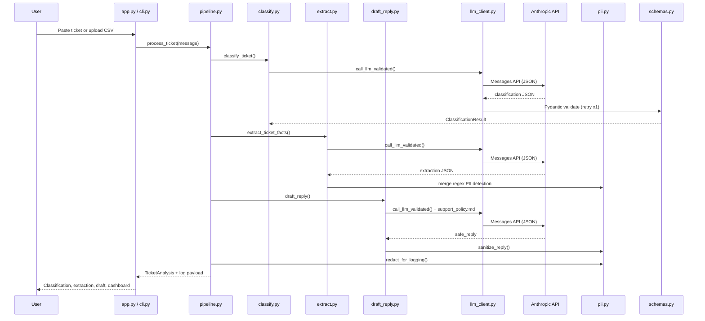
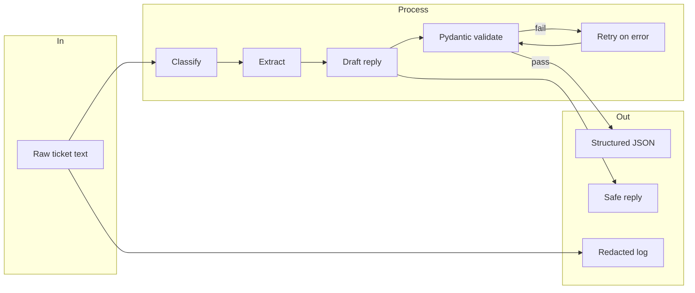
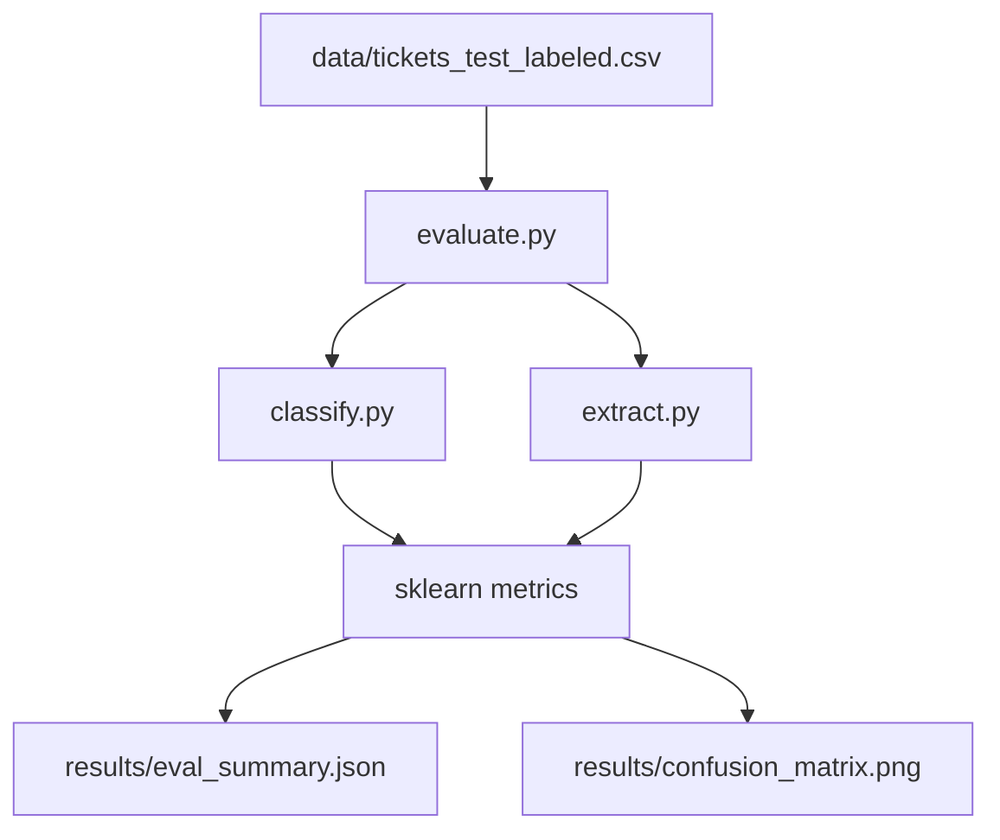

# SupportOps Copilot — Architecture

## System overview

SupportOps Copilot is a **multi-stage LLM pipeline** for customer support tickets. Each ticket passes through classification, extraction, and reply drafting before results are validated, logged safely, and summarized on a dashboard.

---

## High-level flow

---

## Module responsibilities

| Layer | Module | Role |
|-------|--------|------|
| **UI** | `app.py` | Streamlit: analyze, batch, dashboard, policy viewer |
| **UI** | `cli.py` | CLI: analyze, batch, evaluate, metrics |
| **Orchestration** | `pipeline.py` | Runs classify → extract → draft → assemble `TicketAnalysis` |
| **LLM** | `llm_client.py` | Anthropic client, JSON parse, retry, cost/latency tracking |
| **Prompts** | `prompts.py` | System prompts + few-shot classification examples |
| **Classification** | `classify.py` | category, priority, sentiment, sla_risk, confidence |
| **Extraction** | `extract.py` | product, request, missing_info, refund, pii_detected |
| **Reply** | `draft_reply.py` | Policy-grounded `safe_reply` from `data/support_policy.md` |
| **Safety** | `pii.py` | Regex detect/redact email, phone, address, card, SSN |
| **Validation** | `schemas.py` | Pydantic models + enum types |
| **Analytics** | `dashboard.py` | Summaries, bar charts, confusion matrix plot |
| **Evaluation** | `evaluate.py` | macro-F1, priority accuracy, key-field accuracy |
| **Data** | `data/*.csv` | 35 train + 35 labeled test tickets |
| **Policy** | `data/support_policy.md` | Refund, access, shipping, PII, escalation rules |

---

## Data flow diagram

---

## LLM call pattern

Each ticket triggers **3 Anthropic API calls**:

1. **Classify** — few-shot examples from `prompts.py`, temperature ~0.1  
2. **Extract** — structured fact extraction, temperature ~0.1  
3. **Draft** — reads `support_policy.md`, temperature ~0.4  

All calls request **JSON-only** responses, parsed and validated by Pydantic. On validation failure, the error is appended to the prompt and the call **retries once**.

---

## Security & compliance

- **PII detection** runs via LLM + regex (`pii.py`)
- **Logs** use redacted message text before storage
- **Draft replies** are sanitized to avoid leaking PII
- **Policy** prevents unauthorized refund promises and internal disclosures
- **Escalation** flags urgent / SLA-risk tickets in the UI

---

## Evaluation pipeline

Metrics: **category macro-F1**, **priority accuracy**, **key-field accuracy** (product + refund).

---

## Deployment (local)

| File | Purpose |
|------|---------|
| `START.bat` | One-click Windows launcher |
| `run_web.ps1` | PowerShell launcher |
| `config.env` | API key (local only, gitignored) |
| `.env.example` | Template for new setups |

Default URL: **http://127.0.0.1:8501**
